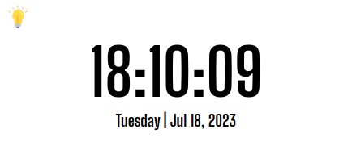
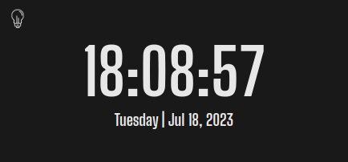

# 🕙 Clock Vite + React App

## 🇺🇸 About this project

This is a simple clock app developed using React and styled using CSS3. It displays the current time and date.
I had the idea to develop it to display in my Notion main page, so I could toggle between dark and light modes depending on the mode I'm using in Notion.

## 📝 Installation
1. Clone the repository `git clone git@github.com:biancashiromoto/react-tic-tac-toe.git`
2. Install the dependencies in the project's root directory by running `npm install`
3. Open the app in the browser `npm run dev`

> 💬 If you have any suggestions or feedbacks, I would be happy to recieve them through <a href="https://www.linkedin.com/in/bshiromoto/" target="_blank">LinkedIn</a>!

## 🇧🇷 Sobre este projeto

Esta é uma aplicação simples de relógio desenvolvida utilizando React e estilizada com CSS3. Ela mostra o horário e data atuais.
Eu tive a ideia de desenvolvê-lo para mostrar as horas na minha página principal no Notion, para que eu pudesse alternar entre os modos escuro e claro dependendo do modo que eu estou usando no Notion.

## 📝 Instalação
1. Clone o repositório com o comando `git clone git@github.com:biancashiromoto/react-tic-tac-toe.git`
2. Instale as dependências no diretório raiz do projeto `npm install`
3. Abra no navegador `npm run dev`

> 💬 Se tiver alguma sugestão ou feedback, eu ficaria feliz em recebê-los pelo meu <a href="https://www.linkedin.com/in/bshiromoto/" target="_blank">LinkedIn</a>!

## 🖼️ Screenshots

  
  

## 🛠️ Technologies used/Tecnologias utilizadas
### Programming languages/Linguagens de programação:

### Frameworks and libraries/Frameworks e bibliotecas:

### Tools and platforms/Ferramentas e plataformas:

